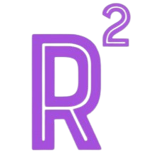

---

  

<h2 align="center">easyROB — Standalone GUI Launcher</h2>

---

### 📦 Downloads

Pre-packaged versions of **easyROB** (with bundled Python environments) are available in the [Releases](../../releases) page.  
👉 Just download the ZIP corresponding to your operating system.

---

### 🖥️ Windows instructions
1. Download and unzip **easyROB_win.zip** from [Releases](../../releases).
2. Inside the folder you will find:
   - `launcher.vbs` → main launcher (starts the app without console window).  
   - `create_shortcut.vbs` → optional, creates a desktop shortcut with the official icon.  
   - `tools/run_easyrob.bat` → internal script with logging and environment setup.  
   - `easyROB/` → contains the GUI code and program icon.  
   - `robert_env_unpacked/` → prebuilt Python environment.
3. Run `launcher.vbs` to start the program.
4. (Optional) Run `create_shortcut.vbs` once to place an **easyROB** icon on your desktop for easier access.

The log file will be stored in `easyrob_process.log` at the root of the folder.

---

### 🐧 Linux instructions (coming soon)
- .

---

### 🍏 macOS instructions (coming soon)
- .

---

### ⚠️ Antivirus / SmartScreen
Since the app is **not code-signed**, it is **normal** that Windows Defender, SmartScreen or other AV software show a warning.  
- Please select **“Run anyway” / “Allow”** if prompted.  
- What matters is whether the file actually runs or if the antivirus blocks/quarantines it.  
- If you encounter issues, report your OS, AV product/version and the exact message.

---

### 📝 Developers and contact
Main developer and contact:  
- [ ] [Miguel Martínez Fernández](https://orcid.org/0009-0002-8538-7250) — [miguel.martinez@csic.es](mailto:miguel.martinez@csic.es)

For feedback, issues and improvements, please use the **Issues** and **Pull requests** tabs on GitHub.  

---

### 📜 License
easyROB standalone launcher is available under an [MIT](https://opensource.org/licenses/MIT) License.  

---
