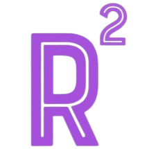

# 🚀 easyROB

**EasyRob** provides simple desktop installers that prepare and launch a fully private runtime environment for the application.

<p align="center">
  
</p>

---

## 📦 Supported Package Formats

| Platform                 | Package                                 |
| ------------------------ | --------------------------------------- |
| 💻 Windows               | `easyrob-<VERSION>.exe`                 |
| 🐧 Linux (Ubuntu/Debian) | `easyrob-<VERSION>.deb`                 |
| 🍎 macOS                 | `easyrob-<VERSION>.dmg`                 |

---

# 👤 For Users

## 💻 Windows

1. Download the installer from **[GitHub Releases](https://github.com/MiguelMartzFdez/EasyRob/releases/)**.
2. Download `easyrob-<VERSION>.exe`
3. Double-click the installer
4. Follow the setup wizard
5. Launch **EasyRob** from:

   * Start Menu
   * Windows Search
   * Desktop Shortcut (optional)

---

## 🐧 Linux

Recommended for Ubuntu and Debian-based distributions.

### Graphical Installation

1. Download the package from **[GitHub Releases](https://github.com/MiguelMartzFdez/EasyRob/releases/)**.
2. Download `easyrob-<VERSION>.deb`
3. Open it with your system package installer
4. Launch **EasyRob** from:

   * Applications Menu
   * Desktop Shortcut (if available)

The first launch creates EasyRob's private runtime under `~/.local/share/easyrob` and may take a few minutes. The environment, package downloads, logs, and runtime files live under that folder.

To fully remove EasyRob on Linux:

* Remove the system package with `sudo apt remove easyrob`
* Remove the private user runtime with `easyrob --uninstall-user-data`

---

## 🍎 macOS

If a macOS build is published in **[GitHub Releases](https://github.com/MiguelMartzFdez/EasyRob/releases/)**:

1. Download `easyrob-<VERSION>.dmg`
2. Open the downloaded disk image
3. Drag `EasyRob.app` into `Applications`
4. Open **EasyRob** using:

   * Applications
   * Launchpad
   * Spotlight

Supported baseline: macOS 11 Big Sur or newer. The macOS bootstrap detects the machine architecture and prepares an Intel (`osx-64`) or Apple Silicon (`osx-arm64`) environment as needed.
The private macOS runtime is stored under `~/Library/ApplicationSupport/EasyRob`.

To fully remove EasyRob on macOS:

* Delete `EasyRob.app` from `Applications`
* Delete `~/Library/ApplicationSupport/EasyRob`
  
---

# ⚡ Runtime Behavior

EasyRob manages everything automatically.

✅ No Python installation required

✅ No Conda installation required

✅ Fully isolated runtime

⏳ Initial installation may take a few minutes

⏳ First launch may be slower while the environment is prepared

💬 A startup message is displayed during longer launches

---

# 🛠️ For Maintainers

## 📍 Source of Truth

Shared dependencies are defined in:

```text
packaging/shared/env.yaml
```

When dependencies change, update this file first.

---

## 📂 Packaging Layout

```text
EasyRob/
├── packaging/
│   ├── shared/
│   ├── windows/
│   ├── linux/
│   └── macos/
├── docs/
└── dist/
```

---

## 📦 Build Outputs

| Platform   | Output                               |
| ---------- | ------------------------------------ |
| 🪟 Windows | `dist/windows/easyrob-<VERSION>.exe` |
| 🐧 Linux   | `dist/linux/easyrob-<VERSION>.deb`   |
| 🍎 macOS   | `dist/macos/easyrob-<VERSION>.dmg`   |

---

# 🖥️ Build Hosts

Each installer is generated on its own operating system.

| Target package                        | Build host |
| ------------------------------------- | ---------- |
| `easyrob-<VERSION>.exe`               | Windows    |
| `easyrob-<VERSION>.deb`               | Linux      |
| `easyrob-<VERSION>.dmg` | macOS      |

You do **not** build all three final artifacts from Windows.

What is shared across all of them is:

- `packaging/shared/env.yaml`
- the same repository
- the same packaging structure

---

# 🔨 Building Packages

## 🪟 Windows

```powershell
.\packaging\windows\build.ps1
```

### Requirements

* Windows
* Inno Setup 6 or 7
* `packaging/windows/assets/Miniforge3-Windows-x86_64.exe`

---

## 🐧 Linux

```bash
chmod +x packaging/linux/build-deb.sh
./packaging/linux/build-deb.sh
```

### Requirements

* Linux
* `dpkg-deb`
* `install`
* `grep`
* `sed`
* `packaging/linux/assets/micromamba-linux-64`

---

## 🍎 macOS

```bash
chmod +x packaging/macos/build.sh
./packaging/macos/build.sh
```

### Requirements

* A real Mac
* macOS 11 Big Sur or newer
* `rsync`
* `hdiutil`
* `grep`
* `sed`

### Output

This build creates:

- `dist/macos/easyrob-<VERSION>.dmg`

---

# 🔄 Updating EasyRob

## Only Packaging Changes

Update:

```text
packaging/windows/
packaging/linux/
packaging/macos/
docs/
```

No dependency rebuild required.

---

## Dependency Changes

1. Edit:

```text
packaging/shared/env.yaml
```

2. Rebuild the installer/package

3. Test on a clean machine

---

# 📚 Documentation

* 📘 Packaging Overview → `docs/packaging.md`
* 🪟 Windows Packaging → `docs/packaging-windows.md`
* 🐧 Linux Packaging → `docs/packaging-linux.md`
* 🍎 macOS Packaging → `docs/packaging-macos.md`

---
